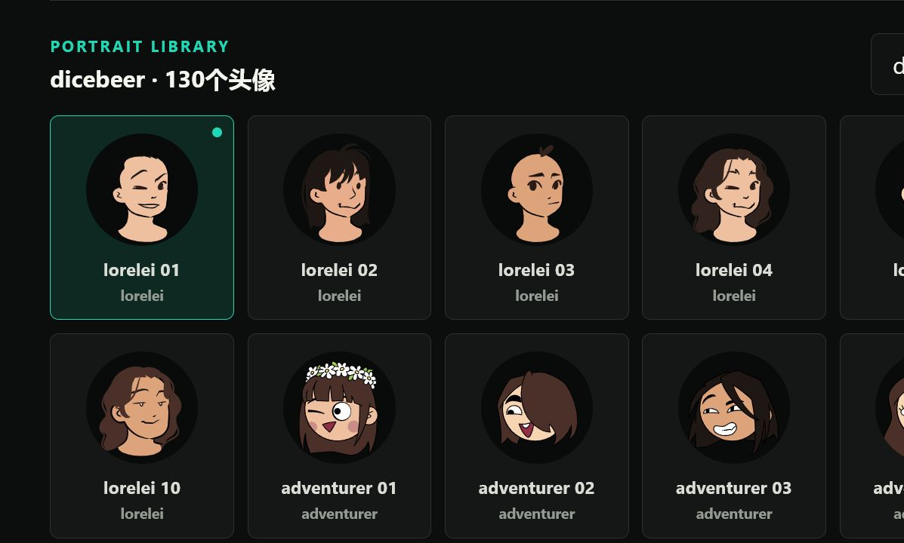
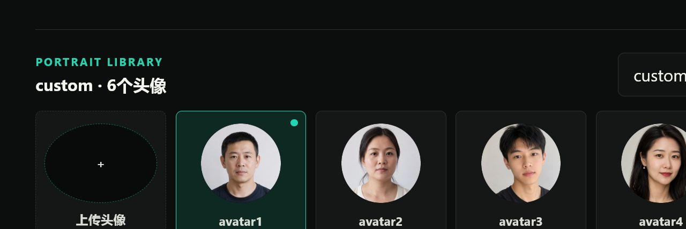

# Voicemod Portrait

一个纯前端、麦克风驱动的头像展示面板。页面包含 VoiceMod 官方 246 个头像，可根据麦克风音量让当前头像轻微缩放和上浮，不使用 AI，也不会上传音频。


## 核心效果

页面通过浏览器实时读取麦克风音量变化，并将声音强弱转换成头像动画。默认使用“一阶”驱动模式：头像会跟随声音自然放大、缩小和轻微上浮，适合直播、录屏、窗口采集或桌面陪伴。

也可以切换到“二阶”驱动模式：在一阶基础上加入更细的开口响应、停止回落、轻微摆动和 `idle / talking / loud` 状态，让静态头像更接近 PNGTuber 的表现。二阶不会使用 AI，只是在本地浏览器里根据麦克风能量做动画判断。

麦克风灵敏度决定多小的声音可以触发动作，动画强度决定放大、缩小和上浮的幅度。所有计算都在本机浏览器内完成，不需要 AI 模型或服务器。

## 界面展示

### 头像库

246 个头像均提供对应名称和缩略图，可通过搜索、卡片或下拉框快速切换。


### DiceBeer 分类

DiceBear 生成头像集中放在 `dicebeer` 分类中，便于和原版 Voicemod 头像分开筛选。



### Custom 分类

`custom` 分类用于浏览器端上传头像，支持自动裁剪、右键重命名和删除。



### 全屏效果

全屏模式仅显示当前头像、麦克风驱动光圈和所选背景，适合直播、录屏或窗口采集。


## 功能

- 246 个头像，支持搜索、缩略图选择和下拉选择
- 头像库支持 `voicemod`、`dicebeer`、`aiface` 和 `custom` 分类
- 默认一阶声音驱动：随麦克风音量放大、缩小、上浮
- 可切换二阶声音驱动：加入 idle / talking / loud 状态和更细的动作反馈
- 麦克风实时驱动，支持灵敏度和动画强度调节
- 双层同心光圈，内亮外暗
- 黑色、白色、绿幕、蓝幕、透明和自定义颜色背景
- 支持选择本地背景图片，并保存在浏览器本地数据库中
- 头像舞台全屏显示
- `aiface` 分类已从本地人脸数据集中随机抽取 300 张图片，并处理为圆形透明头像
- `custom` 分类内置 6 个默认自定义头像，后续上传会从 `avatar7` 开始命名
- `custom` 分类支持浏览器端上传、自动裁剪、右键重命名和删除
- 桌面和移动端响应式布局
- 所有设置均在浏览器本地运行

## 快速启动

### Windows

确认已安装 Python 3，然后双击：

```text
start.bat
```

脚本会选择一个可用端口、启动本地静态服务器并打开浏览器。

### 手动启动

在项目目录运行：

```bash
python -m http.server 8787 --bind 127.0.0.1
```

然后打开：

```text
http://127.0.0.1:8787/
```

不能直接双击 `index.html`，因为浏览器通常会阻止本地文件加载 ES Modules。

## 使用说明

1. 首次打开时允许浏览器使用麦克风。
2. 从头像库或“主头像”下拉框选择头像。
3. 在“驱动模式”里选择“一阶”或“二阶”。默认是一阶。
4. 调整麦克风灵敏度和动画强度。
5. 可选择预设背景、自定义颜色或本地背景图片。
6. 点击预览框右上角“全屏”；全屏后按 `Esc` 退出。

麦克风音频仅通过浏览器 Web Audio API 在本机分析，页面不录音、不保存音频，也没有后端服务。本地背景图片保存在当前站点的 IndexedDB 中。

## AI Face 数据集导入

`aiface` 分类预留给本地下载的人脸数据集。本仓库当前示例从本地 `黄种人-FFHQ` 数据集中随机抽取 300 张图片，并统一处理为 256×256 圆形透明 PNG 头像。此前也可参考 [a312863063/seeprettyface-dataset](https://github.com/a312863063/seeprettyface-dataset)、AFD、CASIA-FaceV5 / CAS-PEAL 等公开入口。请先阅读原项目 README 和授权/使用限制；不要用于商业或不当用途。

下载并解压数据集后，在项目目录运行：

```powershell
powershell -ExecutionPolicy Bypass -File .\scripts\generate-aiface.ps1 -Source "F:\BaiduNetdiskDownload\黄种人-FFHQ" -Count 300 -Size 256
```

脚本会从数据集目录递归随机抽取 300 张 `.jpg` / `.jpeg` / `.png` / `.webp` 图片，做中心裁剪、圆形透明遮罩和统一尺寸缩放，输出到 `assets/aiface/`，并生成 `js/aiface-data.js`。页面刷新后即可在 `aiface` 分类中查看。

## 项目结构

```text
.
|-- assets/
|   |-- portraits/       # 246 张头像图片
|   |-- dicebeer/        # DiceBear 生成头像
|   |-- custom/          # custom 分类默认头像
|   `-- aiface/          # 本地 SeePrettyFace 抽样后生成的 AI 人脸头像
|-- index.html           # 页面结构
|-- js/
|   |-- app.js           # 页面交互与麦克风驱动
|   |-- aiface-data.js   # aiface 分类头像清单
|   |-- data.js          # voicemod 头像名称和文件路径
|   `-- dicebeer-data.js # dicebeer 分类头像清单
|-- docs/
|   |-- screenshot.png
|   |-- portrait-library.png
|   |-- dicebeer-library.png
|   |-- custom-library.png
|   `-- fullscreen.png
|-- scripts/
|   |-- generate-aiface.ps1
|   `-- generate-dicebeer.ps1
|-- styles.css           # 界面样式
|-- start.bat            # Windows 双击启动
`-- README.md
```

## 参考与致谢

感谢以下项目和数据来源：

- [Voicemod](https://www.voicemod.net/)：感谢其官方头像素材，本项目的 `voicemod` 分类以这些头像作为基础头像来源。
- [DiceBear](https://www.dicebear.com/)：开源头像生成库，本项目的 `dicebeer` 分类使用 DiceBear 风格生成。
- [Avataaars](https://getavataaars.com/)：经典组合式头像项目，用作头像制作参考入口。
- [Open Peeps](https://www.openpeeps.com/)：开源人物插画组件库，用作人物头像参考入口。
- [a312863063/seeprettyface-dataset](https://github.com/a312863063/seeprettyface-dataset)：StyleGAN 生成的人脸数据集，作为 `aiface` 分类的推荐本地数据来源。
- [Asian Face Image Dataset, AFD](https://github.com/X-zhangyang/Asian-Face-Image-Dataset-AFD-dataset)：亚洲人脸数据集参考入口。
- [CASIA-FaceV5 / CAS-PEAL](https://iapr-tc4.org/face-datasets/)：人脸数据集参考入口。

使用任何第三方图片、头像或数据集前，请自行确认对应项目的许可、署名要求、用途限制和肖像权风险。
