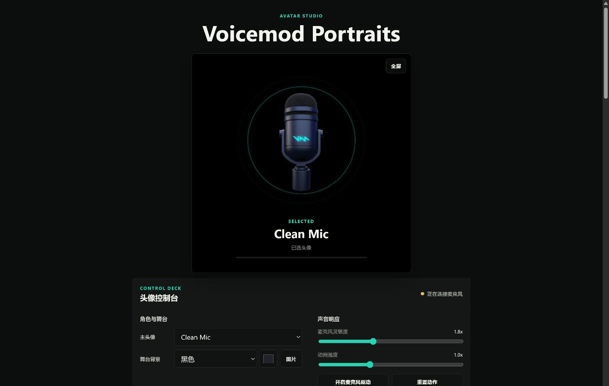
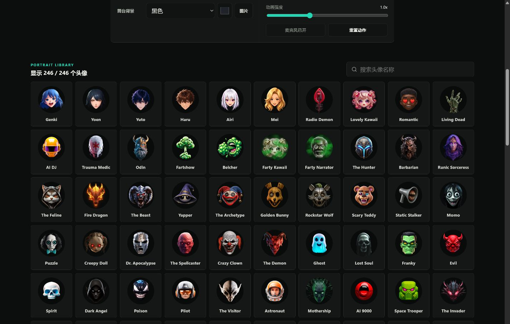

# Voicemod Portraits

一个纯前端、麦克风驱动的头像展示面板。页面包含 VoiceMod 官方 246 个头像，可根据麦克风音量让当前头像轻微缩放和上浮，不使用 AI，也不会上传音频。



## 核心效果

页面通过浏览器实时读取麦克风的音量变化，并将声音强弱转换成头像动画：说话时头像会灵动地放大并轻微上浮，停顿时平滑缩小并回到原位。双层光圈也会跟随声音产生呼吸感，让静态头像具有自然的说话反馈。

麦克风灵敏度决定多小的声音可以触发动作，动画强度决定放大、缩小和上浮的幅度。所有计算都在本机浏览器内完成，不需要 AI 模型或服务器。

## 界面展示

### 头像库

246 个头像均提供对应名称和缩略图，可通过搜索、卡片或下拉框快速切换。



### 全屏效果

全屏模式仅显示当前头像、麦克风驱动光圈和所选背景，适合直播、录屏或窗口采集。


## 功能

- 246 个头像，支持搜索、缩略图选择和下拉选择
- 麦克风实时驱动，支持灵敏度和动画强度调节
- 双层同心光圈，内亮外暗
- 黑色、白色、绿幕、蓝幕、透明和自定义颜色背景
- 支持选择本地背景图片，并保存在浏览器本地数据库中
- 头像舞台全屏显示
- 桌面和移动端响应式布局
- 所有设置均在浏览器本地运行

## 快速启动

### Windows

确认已安装 Python 3，然后双击：

```text
start.bat
```

脚本会选择一个可用端口、启动本地静态服务器并打开浏览器。

### 手动启动

在项目目录运行：

```bash
python -m http.server 8787 --bind 127.0.0.1
```

然后打开：

```text
http://127.0.0.1:8787/
```

不能直接双击 `index.html`，因为浏览器通常会阻止本地文件加载 ES Modules。

## 使用说明

1. 首次打开时允许浏览器使用麦克风。
2. 从头像库或“主头像”下拉框选择头像。
3. 调整麦克风灵敏度和动画强度。
4. 可选择预设背景、自定义颜色或本地背景图片。
5. 点击预览框右上角“全屏”；全屏后按 `Esc` 退出。

麦克风音频仅通过浏览器 Web Audio API 在本机分析，页面不录音、不保存音频，也没有后端服务。本地背景图片保存在当前站点的 IndexedDB 中。

## 项目结构

```text
.
|-- assets/
|   `-- portraits/       # 246 张头像图片
|-- app.js               # 页面交互与麦克风驱动
|-- data.js              # 头像名称和文件路径
|-- index.html           # 页面结构
|-- docs/
|   `-- screenshot.png  # 项目页面截图
|-- styles.css           # 界面样式
|-- start.bat            # Windows 双击启动
`-- README.md
```
